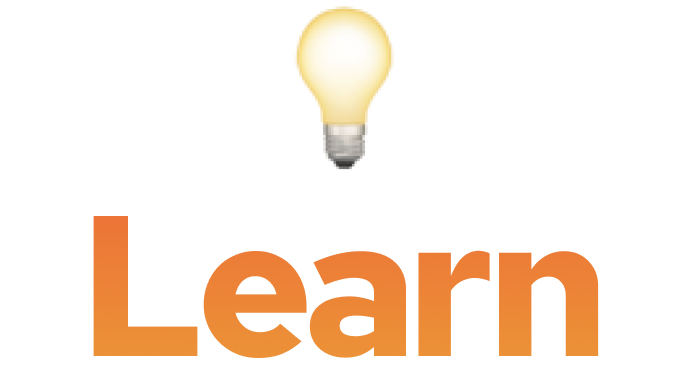

# Learn

## Who's it for?

Software devs who want to learn codebases, languages, and frameworks faster.

## What is it?

Learn is a Visual Studio Code extension which takes advantage of a few newer technologies to provide developer learning opportunities where they matter most: directly inline with the codebases and languages you are working on. It helps you stay in the flow of editing and building, while providing you several new ways to traverse the codebase at hand expressly for learning purposes. Since we had 24 hours, we focused on one particular language: Rust, which gives programmers several new mental models and tools for solving problems with code, but which has a (fair) reputation for having a significant learning curve.

### Features

#### Code intelligence based on deep syntax parsing

We use a duo of newer code parsing technologies, language server protocol and tree-sitter, in order to have live reference not only to the normal call-site -> definition and docstring parsing most tools come with, but to the actual abstract syntax tree underlying which represents Rust's semantics and best captures what's unique and valuable about this language.

This allows us to do things like differentiate reserved keywords from each other (which most code editing tools fail in an epic way at), linking to the higher-level docs which get at the "why" of the language, not just the what. We can also parse, differentiate, and document symbols and operators, of which Rust has notoriously many, and which are often the hardest parts of a language to "just Google."

#### Concept sequencing for acquisition

The higher level of curated conceptual linking that this rich code metadata gives us also enables to capture and order the language concepts which particular codebases and files make use of. With this data, we can provide purpose-built learning tracks which will help you learn just what you need to to understand the code you are looking at, fast.

#### Future: team code curation

All of the above data we have captured in comments, documentary links, and examples which don't just show up at particular lines in the code: they are linked to the underlying concepts and language primitives of Rust, as expressed first in [./src/data/nodeTypeToConcept.json](./src/data/nodeTypeToConcept.json). This is a declarative format, which we intend in future work to attach to tools that let teams capture important codebase- and language-specific knowledge. Instead of sending a teammate to a README or even worse a wiki, this will allow documentation to show up wherever concepts are, even as they move around or pop back up in code that doesn't even exist today

#### (and all the other stuff too)

We have implemented this all in the context of Visual Studio Code, an [increasingly popular tool](https://www.zdnet.com/article/facebook-microsofts-visual-studio-code-is-now-our-default-development-platform/) which provides compatibility with many teams' workflow and preferred toolchains. This is the perfect place to develop Learn into a learning tool for any language or framework, but also for any developer or team's personal learning and development workflow.

## Requirements

VSCode. It'll tell you if it's too old. Clone this repo, `cd` into it, and run `code .` That will open up an editor, and if you then run `F5`, you'll launch the extension in a second test instance of Visual Code Studio. Simply navigate that instance to a Rust source file to start trying and developing Learn.

## Anything else?

Thanks, and hit us up at hello@platter.dev if you're interested in collaborating, sharing your stories and wishlist for dev tooling and learning, or just hanging out together in person or online. Cheers!
